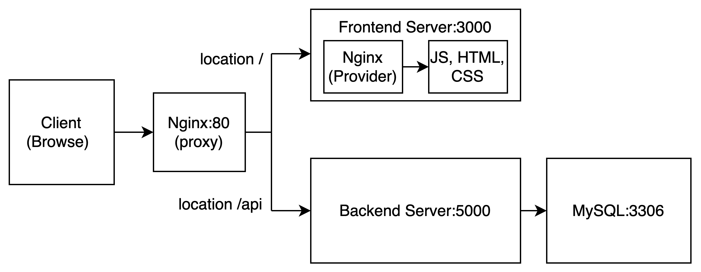

# 멀티 컨테이너를 이용한 애플리케이션 개발 환경 구축

### 배포 과정
- **github -> travis-ci -> aws**
### Travis CI
1. 깃헙에 코드 푸시
2. Travis CI가 자동으로 코드를 가져옴
3. 가져온 코드로 테스트 실행
4. 성공하면 운영 환경의 이미지 빌드
5. 빌드된 이미지를 도커 허브로 전송
6. 도커 허브에 이미지를 보냈다고 AWS EB에 알림
### AWS
1. AWS EB에서 도커 허브에 있는 이미지를 가져온 다음 배포

## 설계

## nginx 프록시를 이용해 프론트엔드 서버 & 백엔드 서버로 각 요청 분기
- [x] 요청이 /api로 시작하면 백엔드 서버로 요청
- [x] 요청이 /api를 제외한 모든 요청은 프론트엔드 서버로 요청

## fe에서 정적파일 제공을 위해 nginx 사용
- [x] fe에서 정적파일 제공을 위해 nginx 사용

## 서비스별 도커파일 작성
- [x] backend
- [x] frontend
- [x] mysql
- [x] nginx

## docker-compose 파일 작성
- [x] docker-compose 파일 작성

